# Table of contents <!-- omit in toc -->

- [1. Overview](#1-overview)
- [2. Get started](#2-get-started)
- [3. Start from scratch](#3-start-from-scratch)
  - [3.1. Prerequisites](#31-prerequisites)
  - [3.2. Initialize a new Expo app](#32-initialize-a-new-expo-app)
  - [3.3. Download assets](#33-download-assets)
  - [3.4. Run reset-project script](#34-run-reset-project-script)
  - [3.5. Run the app on mobile and web](#35-run-the-app-on-mobile-and-web)
  - [3.6. Make your first change](#36-make-your-first-change)
  - [3.7. Add navigation](#37-add-navigation)
    - [3.7.1. Expo Router basics](#371-expo-router-basics)
    - [3.7.2. Add a new screen to the stack](#372-add-a-new-screen-to-the-stack)
    - [3.7.3. Navigate between screens](#373-navigate-between-screens)
    - [3.7.4. Add a not-found route](#374-add-a-not-found-route)
    - [3.7.5. Add a bottom tab navigator](#375-add-a-bottom-tab-navigator)
    - [3.7.6. Install @react-native-vector-icons](#376-install-react-native-vector-icons)
    - [3.7.7. Update bottom tab navigator appearance](#377-update-bottom-tab-navigator-appearance)
  - [3.8. Build a screen](#38-build-a-screen)
    - [3.8.1. Display the image](#381-display-the-image)
    - [3.8.2. Divide components into files](#382-divide-components-into-files)
    - [3.8.3. Create buttons using Pressable](#383-create-buttons-using-pressable)
    - [3.8.4. Enhance the reusable button component](#384-enhance-the-reusable-button-component)
  - [3.9. Use an image picker](#39-use-an-image-picker)
    - [3.9.1. Install expo-image-picker](#391-install-expo-image-picker)
    - [3.9.2. Pick an image from the device's media library](#392-pick-an-image-from-the-devices-media-library)
    - [3.9.3. Update the button component](#393-update-the-button-component)
    - [3.9.4. Use the selected image](#394-use-the-selected-image)
  - [3.10. Create a modal](#310-create-a-modal)
    - [3.10.1. Declare a state variable to show buttons](#3101-declare-a-state-variable-to-show-buttons)
    - [3.10.2. Add buttons](#3102-add-buttons)
    - [3.10.3. Create an emoji picker modal](#3103-create-an-emoji-picker-modal)
    - [3.10.4. Display a list of emoji](#3104-display-a-list-of-emoji)
    - [3.10.5. Display the selected emoji](#3105-display-the-selected-emoji)

# 1. Overview

This is a React Native with Expo project that runs on Android, iOS, and web; all with a single codebase.

It covers the following topics:

- Create an app using the default template with TypeScript enabled
- Implement a two-screen bottom tabs layout with Expo Router
- Break down the app layout and implement it with flexbox
- Use each platform's system UI to select an image from the media library
- Create a sticker modal using the `<Modal>` and `<FlatList>` components from React Native
- Add touch gestures to interact with a sticker
- Use third-party libraries to capture a screenshot and save it to the disk
- Handle platform differences between Android, iOS, and web
- Finally, go through the process of configuring a status bar, a splash screen, and an icon to complete the app

# 2. Get started

1. Install dependencies

   ```bash
   npm install
   ```

2. Start the app

   ```bash
   npx expo start
   ```

In the output, you'll find options to open the app in a

- [development build](https://docs.expo.dev/develop/development-builds/introduction/)
- [Android emulator](https://docs.expo.dev/workflow/android-studio-emulator/)
- [iOS simulator](https://docs.expo.dev/workflow/ios-simulator/)
- [Expo Go](https://expo.dev/go), a limited sandbox for trying out app development with Expo

# 3. Start from scratch

## 3.1. Prerequisites

- Install [Expo Go](https://expo.dev/go) on a physical Android or iOS device.
- Install Node.js (LTS version) on your machine.
- VS Code or any code editor
- A macOS, Linux, or Windows (PowerShell and WSL2) with a terminal window open.
- Familiarity with TypeScript and React.

## 3.2. Initialize a new Expo app

Run `create-expo-app` to initialize a new Expo app. This will create a new React Native project:

```bash
npx create-expo-app@latest StickerSmash
cd StickerSmash
```

> During the installation process, CLI will prompt your to choose a template. Select SDK 57.

This command will create a new project directory named `StickerSmash`, using the default template.

Benefits of using default template:

- Creates a new React Native project with expo package installed
- Includes recommended tools such as Expo CLI
- Includes a tab navigator from Expo Router to provide a basic navigation system
- Automatically configured to run a project on multiple platforms: Android, iOS, and web
- TypeScript configured by default

## 3.3. Download assets

- Download assets archive from [this link](https://docs.expo.dev/static/images/tutorial/sticker-smash-assets.zip)

- Unzip the archive and replace the default assets in the `your-project-name/assets/images` directory.
- Open the project directory in a code editor or IDE.

## 3.4. Run reset-project script

Let's run the reset-project script to remove the boilerplate code:

```bash
npm run reset-project
```

`reset-project` script resets the `src/app` directory structure and moves the previous boilerplate files from the `src` directory to another sub-directory called `example`. We can delete it.

## 3.5. Run the app on mobile and web

In the project directory, run the following command to start the development server:

```bash
npx expo start
```

After running the above command:

1. The development server will start, and you'll see a QR code inside the terminal window.
2. Scan that QR code to open the app on the device. On Android, use the `Expo Go > Scan QR` code option. On iOS, use the default camera app.
3. To run the web app, press `W` in the terminal. It will open the web app in the default web browser.

Once it is running on all platforms, the app should look like this:

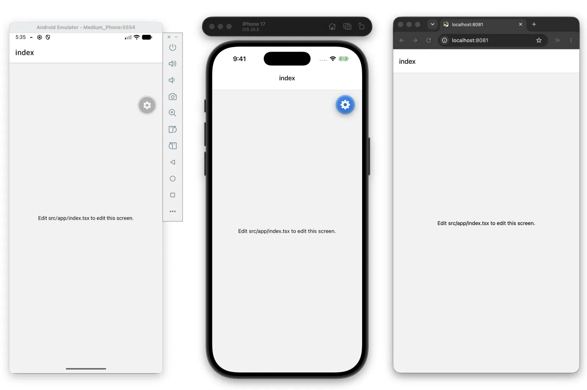

> [!TIP]
> Make sure you are on the same Wi-Fi network on your computer and your device. If it still doesn't work, it may be due to the router configuration — this is common for public networks.
>
> You can choose the Tunnel connection type when starting the development server, then scanning the QR code again.
>
> ```bash
> npx expo start --tunnel
> ```
>
> Using the Tunnel connection type will make the app reloads considerably slower than on LAN or Local, so it's best to avoid tunnel when possible. You may want to install and use an emulator or simulator to speed up development if Tunnel is required to access your machine from another device on your network.

## 3.6. Make your first change

The `src/app/index.tsx` file is the entry point of our app and executes when the development server starts. It uses core React Native components such as `<View>` and `<Text>` to display background and text.

Styles applied to these components use JavaScript objects rather than CSS. Most React Native components accept a `style` prop that accepts a JavaScript object as its value.

Let's modify `src/app/index.tsx` screen:

- Add a `styles.container.backgroundColor` property to `<View>` with the value of `#25292e` to change the background color.
- Replace the default value of `<Text>` with "Home screen".
- Add a `styles.text.color` property to `<Text>` with the value of `#fff` (white) to change the text color.

`src/app/index.tsx`

```tsx
import { Text, View, StyleSheet } from "react-native"

export default function Index() {
  return (
    <View style={styles.container}>
      <Text style={styles.text}>Home screen</Text>
    </View>
  )
}

const styles = StyleSheet.create({
  container: {
    flex: 1,
    alignItems: "center",
    justifyContent: "center",
    backgroundColor: "#25292e", // new
  },
  // new
  text: {
    color: "#fff",
  },
})
```

Once you save your changes, they're applied to the running apps connected to the development server:

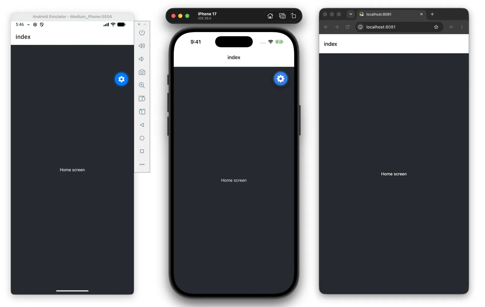

Commit changes.

## 3.7. Add navigation

In this section, we'll see Expo Router's fundamentals to create stack navigation and a bottom tab bar with two tabs.

### 3.7.1. Expo Router basics

Expo Router is a file-based routing framework. To get started, we need to know about the following conventions:

- `app` directory: A special directory containing only routes and their layouts. Any files added to this directory become a screen inside our native app and a page on the web. In the default template, it is located at `src/app`.
- Root layout: The `src/app/_layout.tsx` file. It defines shared UI elements such as headers and tab bars so they are consistent between different routes.
- File name conventions: _Index_ file names, such as `index.tsx` file in the `src/app` directory matches `/` route.

### 3.7.2. Add a new screen to the stack

create a new file named `about.tsx` inside the `src/app` directory. It displays the screen name when the user navigates to the `/about` route.

```tsx
import { Text, View, StyleSheet } from "react-native"

export default function AboutScreen() {
  return (
    <View style={styles.container}>
      <Text style={styles.text}>About screen</Text>
    </View>
  )
}

const styles = StyleSheet.create({
  container: {
    flex: 1,
    backgroundColor: "#25292e",
    justifyContent: "center",
    alignItems: "center",
  },
  text: {
    color: "#fff",
  },
})
```

Then, inside `src/app/_layout.tsx`:

1. Add a `<Stack.Screen />` component and an `options` prop to update the title of the `/about` route.
2. Update the `/index` route's title to `Home` by adding `options` prop.

`src/app/_layout.tsx`

```tsx
import { Stack } from "expo-router"

export default function RootLayout() {
  return (
    <Stack>
      <Stack.Screen name="index" options={{ title: "Home" }} />
      <Stack.Screen name="about" options={{ title: "About" }} />
    </Stack>
  )
}
```

A stack navigator is the foundation for navigating between different screens in an app. On Android, a stacked route animates on top of the current screen. On iOS, a stacked route animates from the right.

### 3.7.3. Navigate between screens

We'll use Expo Router's `Link` component to navigate from the `/index` route to the `/about` route.

`src/app/index.tsx`

```tsx
import { Text, View, StyleSheet } from "react-native"
import { Link } from "expo-router"

export default function Index() {
  return (
    <View style={styles.container}>
      <Text style={styles.text}>Home screen</Text>
      <Link href="/about" style={styles.button}>
        Go to About screen
      </Link>
    </View>
  )
}

const styles = StyleSheet.create({
  // ...
  button: {
    fontSize: 20,
    textDecorationLine: "underline",
    color: "#fff",
  },
})
```

Take a look at the changes in our app. Click on Link to navigate to the `/about` route:

### 3.7.4. Add a not-found route

When a route doesn't exist, we can use a `+not-found` route to display a custom fallback screen. Expo Router uses a special `+not-found.tsx` file to handle this case.

Create a new file named `+not-found.tsx` inside the `src/app` directory to add the `NotFoundScreen` component.
Add `options` prop from the `Stack.Screen` to display a custom screen title for this route.
Add a `Link` component to navigate to the `/` route.

`src/app/+not-found.tsx`

```tsx
import { Link, Stack } from "expo-router"
import { StyleSheet, View } from "react-native"

export default function NotFoundScreen() {
  return (
    <>
      <Stack.Screen options={{ title: "Oops! Not Found" }} />
      <View style={styles.container}>
        <Link href={"/"} style={styles.button}>
          Go back to Home screen!
        </Link>
      </View>
    </>
  )
}

const styles = StyleSheet.create({
  container: {
    flex: 1,
    alignItems: "center",
    justifyContent: "center",
    backgroundColor: "#25292e",
  },
  button: {
    fontSize: 20,
    textDecorationLine: "underline",
    color: "#fff",
  },
})
```

To test this, navigate to http://localhost:8081/123 URL in the web browser since it is easy to change the URL path there.

### 3.7.5. Add a bottom tab navigator

We'll add a bottom tab navigator to our app.

- Inside the `src/app` directory, add a `(tabs)` subdirectory. This special directory is used to group routes together and display them in a bottom tab bar.
- Create a `(tabs)/_layout.tsx` file inside the directory. It will be used to define the tab layout, which is separate from Root layout.
- Move the existing `index.tsx` and `about.tsx` files inside the `(tabs)` directory. The structure of `src/app` directory will look like this:

```
src/app
├── _layout.tsx
├── +not-found.tsx
└── (tabs)
    ├── _layout.tsx
    ├── index.tsx
    └── about.tsx
```

Update the Root layout file to add a `(tabs)` route:

`src/app/_layout.tsx`

```tsx
import { Stack } from "expo-router"

export default function RootLayout() {
  return (
    <Stack>
      <Stack.Screen name="(tabs)" options={{ headerShown: false }} />
    </Stack>
  )
}
```

Inside `(tabs)/_layout.tsx`, add a `Tabs` component to define the bottom tab layout:

`src/app/(tabs)/_layout.tsx`

```tsx
import { Tabs } from "expo-router"

export default function TabLayout() {
  return (
    <Tabs>
      <Tabs.Screen name="index" options={{ title: "Home" }} />
      <Tabs.Screen name="about" options={{ title: "About" }} />
    </Tabs>
  )
}
```

Let's take a look at our app now to see the new bottom tabs:

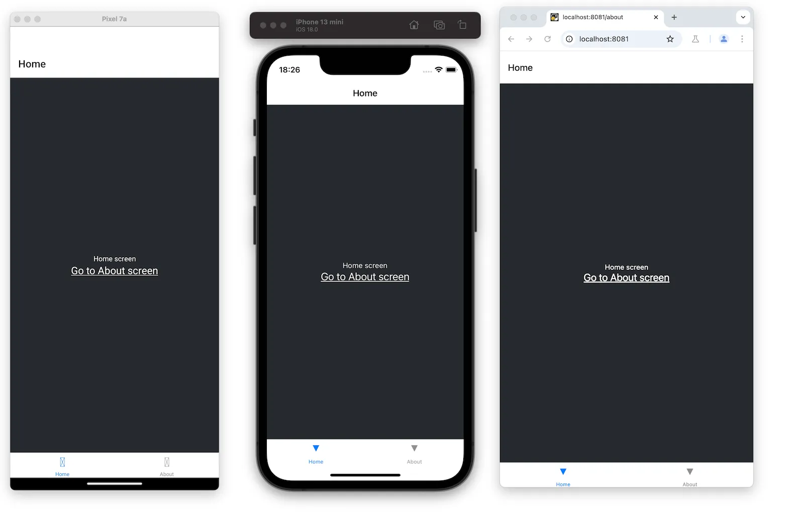

### 3.7.6. Install @react-native-vector-icons

> [!WARNING]
> Do not use `@expo/vector-icons` as it will be deprecated. Rather, use `@react-native-vector-icons/*`. The old `@react-native-vector-icons` is also deprecated. Now the correct way to use them is to [install per icon family](https://www.npmjs.com/org/react-native-vector-icons)

For now, we will install `ionicons`.
To install it, stop the development server by pressing `Ctrl + C` in the terminal, then run the following command:

```bash
npx expo install @react-native-vector-icons/ionicons
```

> [!NOTE]
> We use `npx expo install` instead of `npm install` when we use expo framework/cli.

After the installation completes, start the development server again by running `npx expo start` or in case, `npx expo start --tunnel`.

### 3.7.7. Update bottom tab navigator appearance

Right now, the tab bar or header doesn't display a custom icon, and the bottom tab background color doesn't match the app's background color.

Modify the `src/app/(tabs)/_layout.tsx` file to add tab bar icons:

- Import `{Ionicons}` icons set from `@react-native-vector-icons/ionicons`.
- Add the `tabBarIcon` to both the `index` and `about` routes. This function takes `focused` and `color` as params and renders the icon component. From the icon set, we can provide custom icon names.
- Add `screenOptions.tabBarActiveTintColor` to the `Tabs` component and set its value to `#ffd33d`. This will change the color of the tab bar icon and label when active.

`src/app/(tabs)/_layout.tsx`

```tsx
import { Tabs } from "expo-router"
import { Ionicons } from "@react-native-vector-icons/ionicons" //new

export default function TabLayout() {
  return (
    <Tabs
      screenOptions={{
        tabBarActiveTintColor: "#ffd33d",
      }}
    >
      <Tabs.Screen
        name="index"
        options={{
          title: "Home",
          tabBarIcon: ({ color, focused }) => (
            <Ionicons
              name={focused ? "home-sharp" : "home-outline"}
              color={color}
              size={24}
            />
          ),
        }}
      />
      <Tabs.Screen
        name="about"
        options={{
          title: "About",
          tabBarIcon: ({ color, focused }) => (
            <Ionicons
              name={
                focused ? "information-circle" : "information-circle-outline"
              }
              color={color}
              size={24}
            />
          ),
        }}
      />
    </Tabs>
  )
}
```

Let's also change the background color of the tab bar and header using `screenOptions` prop:

`src/app/(tabs)/_layout.tsx`

```tsx
<Tabs
  screenOptions={{
    tabBarActiveTintColor: "#ffd33d",
    tabBarInactiveTintColor: "#fff8",
    tabBarStyle: {
      backgroundColor: "#25292e",
    },
    headerStyle: {
      backgroundColor: "#25292e",
    },
    headerShadowVisible: false,
    headerTintColor: "#fff",
  }}
>
```

Our app now has a custom bottom tabs navigator:

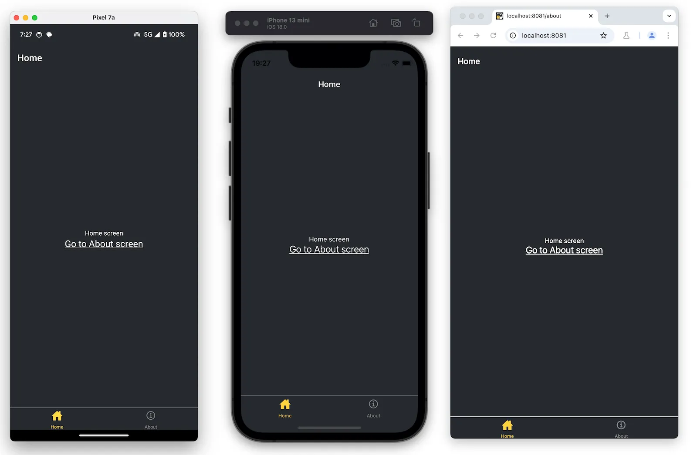

## 3.8. Build a screen

In this section, we'll create the first screen of the StickerSmash app:

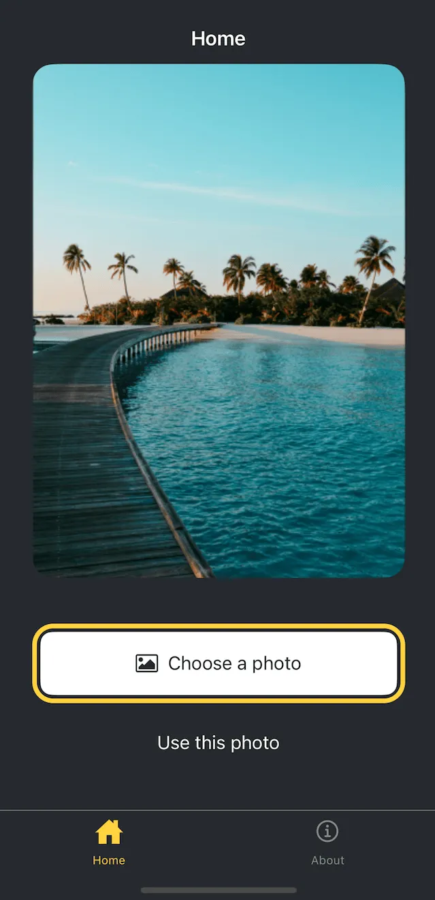

The screen above displays an image and two buttons. The first button allows the user to select an image from their device. The second button allows the user to continue with a default image provided by the app.

Once the user selects an image, they can add a sticker to it.

### 3.8.1. Display the image

We'll use `expo-image` library which is already included in the default project template. It provides a cross-platform `<Image>` component.

The `Image` component takes the `source` as its value. The source uses `require` when the image is static and comes from `assets/images` directory. It can also come from Network as a `uri` property.

Replace everything in `src/app/index.tsx` file with the following:

```tsx
import { Image } from "expo-image"
import { StyleSheet, View } from "react-native"

const PlaceholderImage = require("@/assets/images/background-image.png")

export default function Index() {
  return (
    <View style={styles.container}>
      <View style={styles.imageContainer}>
        <Image source={PlaceholderImage} style={styles.image} />
      </View>
    </View>
  )
}

const styles = StyleSheet.create({
  // `View` is already a flex container
  container: {
    flex: 1,
    alignItems: "center",
    backgroundColor: "#25292e",
  },
  imageContainer: {
    flex: 1,
  },
  image: {
    // width and height/aspect ratio required
    width: "85%",
    aspectRatio: 320 / 440,
    borderRadius: 18,
  },
})
```

### 3.8.2. Divide components into files

Let's divide the code into multiple files as we add more components to this screen.

Create a `components` directory inside `src`, and inside it, create the `image-viewer.tsx` file.

Move the code to display the image in this file along with the image styles:

`src/components/image-viewer.tsx`

```tsx
import { Image } from "expo-image"
import { ImageSourcePropType, StyleSheet } from "react-native"

type Props = {
  imgSource: ImageSourcePropType
}

export default function ImageViewer({ imgSource }: Props) {
  return <Image source={imgSource} style={styles.image} />
}

const styles = StyleSheet.create({
  image: {
    // width and height/aspect ratio required
    width: "85%",
    aspectRatio: 320 / 440,
    borderRadius: 18,
  },
})
```

Import `ImageViewer` and use it in the `src/app/(tabs)/index.tsx`:

```tsx
import ImageViewer from "@/components/image-viewer"
import { StyleSheet, View } from "react-native"

const PlaceholderImage = require("@/assets/images/background-image.png")

export default function Index() {
  return (
    <View style={styles.container}>
      <View style={styles.imageContainer}>
        <ImageViewer imgSource={PlaceholderImage} />
      </View>
    </View>
  )
}

const styles = StyleSheet.create({
  // `View` is already a flex container
  container: {
    flex: 1,
    alignItems: "center",
    backgroundColor: "#25292e",
  },
  imageContainer: {
    flex: 1,
  },
})
```

### 3.8.3. Create buttons using Pressable

React Native includes a few different components for handling touch events, but `<Pressable>` is recommended. It can detect single taps, long presses, trigger separate events when the button is pushed in and released, and more.

There are two buttons we will create. Each has a different style and label. Let's start by creating a reusable component for these buttons. Create a `button.tsx` file inside the `src/components` directory with the following code:

```tsx
import { StyleSheet, View, Pressable, Text } from "react-native"

type Props = {
  label: string
}

export default function Button({ label }: Props) {
  return (
    <View style={styles.buttonContainer}>
      <Pressable
        style={styles.button}
        onPress={() => alert("You pressed a button.")}
      >
        <Text style={styles.buttonLabel}>{label}</Text>
      </Pressable>
    </View>
  )
}

const styles = StyleSheet.create({
  buttonContainer: {
    width: 320,
    height: 68,
    marginHorizontal: 20,
    alignItems: "center",
    justifyContent: "center",
    padding: 3,
  },
  button: {
    borderRadius: 10,
    width: "100%",
    height: "100%",
    alignItems: "center",
    justifyContent: "center",
    flexDirection: "row",
  },
  buttonLabel: {
    color: "#fff",
    fontSize: 16,
  },
})
```

Let's import this component into `src/app/(tabs)/index.tsx` file and add styles for the `<View>` that encapsulates these buttons:

```tsx
import { View, StyleSheet } from "react-native"

import Button from "@/components/button"
import ImageViewer from "@/components/image-viewer"

const PlaceholderImage = require("@/assets/images/background-image.png")

export default function Index() {
  return (
    <View style={styles.container}>
      <View style={styles.imageContainer}>
        <ImageViewer imgSource={PlaceholderImage} />
      </View>
      <View style={styles.footerContainer}>
        <Button label="Choose a photo" />
        <Button label="Use this photo" />
      </View>
    </View>
  )
}

const styles = StyleSheet.create({
  container: {
    flex: 1,
    backgroundColor: "#25292e",
    alignItems: "center",
  },
  imageContainer: {
    flex: 1,
  },
  footerContainer: {
    flex: 1 / 3,
    alignItems: "center",
  },
})
```

Let's take a look at our app on Android, iOS and the web:

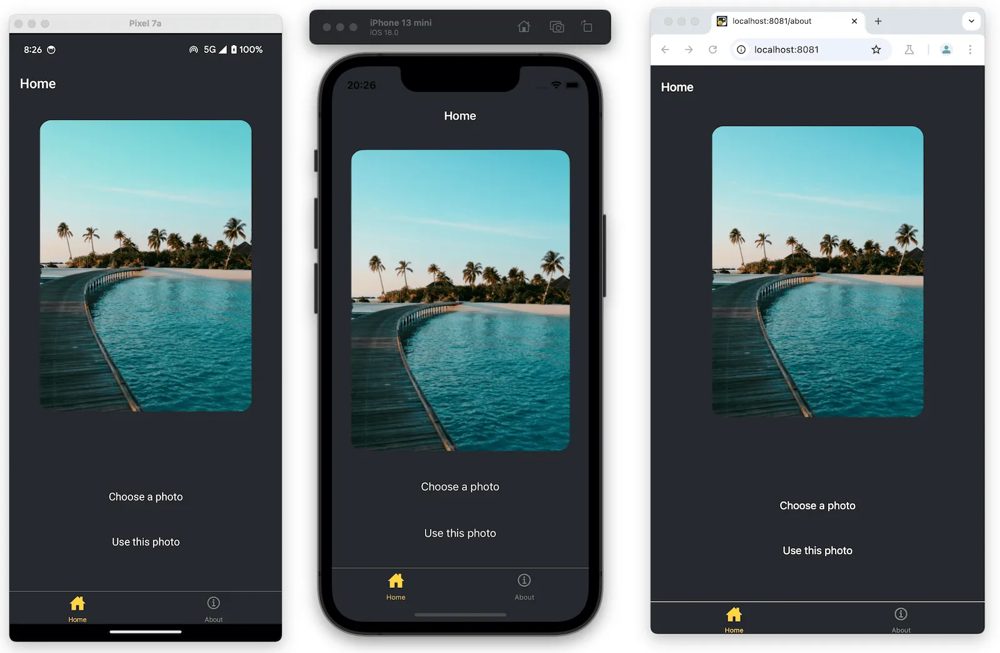

The app displays an alert when the user taps any of the buttons on the screen. It happens because `<Pressable>` calls `alert()` on its `onPress` prop.

We'll keep the second button with the label "Use this photo" as it is. However, we'll add more styling to the first button.

### 3.8.4. Enhance the reusable button component

To add different styling to the "Choose a photo" button, we will add a new `theme` prop that will allow us to apply a primary theme. This button also has an icon before the label. We will use a FontAwesome icon from the `@react-native-vector-icons` library. So, first install the library:

```bash
npx expo install @react-native-vector-icons/fontawesome
```

Then, modify `src/components/button.tsx`:

```tsx
import { StyleSheet, View, Pressable, Text } from "react-native"
import { FontAwesome } from "@react-native-vector-icons/fontawesome"

type Props = {
  label: string
  theme?: "primary"
}

export default function Button({ label, theme }: Props) {
  if (theme === "primary") {
    return (
      <View
        style={[
          styles.buttonContainer,
          { borderWidth: 4, borderColor: "#ffd33d", borderRadius: 18 },
        ]}
      >
        <Pressable
          style={[styles.button, { backgroundColor: "#fff" }]}
          onPress={() => alert("You pressed a button.")}
        >
          <FontAwesome
            name="picture-o"
            size={18}
            color="#25292e"
            style={styles.buttonIcon}
          />
          <Text style={[styles.buttonLabel, { color: "#25292e" }]}>
            {label}
          </Text>
        </Pressable>
      </View>
    )
  }

  return (
    <View style={styles.buttonContainer}>
      <Pressable
        style={styles.button}
        onPress={() => alert("You pressed a button.")}
      >
        <Text style={styles.buttonLabel}>{label}</Text>
      </Pressable>
    </View>
  )
}

const styles = StyleSheet.create({
  buttonContainer: {
    width: 320,
    height: 68,
    marginHorizontal: 20,
    alignItems: "center",
    justifyContent: "center",
    padding: 3,
  },
  button: {
    borderRadius: 10,
    width: "100%",
    height: "100%",
    alignItems: "center",
    justifyContent: "center",
    flexDirection: "row",
  },
  buttonIcon: {
    paddingRight: 8,
  },
  buttonLabel: {
    color: "#fff",
    fontSize: 16,
  },
})
```

Now, modify the `src/app/(tabs)/index.tsx` file to use the `theme="primary"` prop on the first button:

```tsx
<View style={styles.footerContainer}>
  <Button theme="primary" label="Choose a photo" />
  <Button label="Use this photo" />
</View>
```

Let's take a look at our app on Android, iOS and the web:

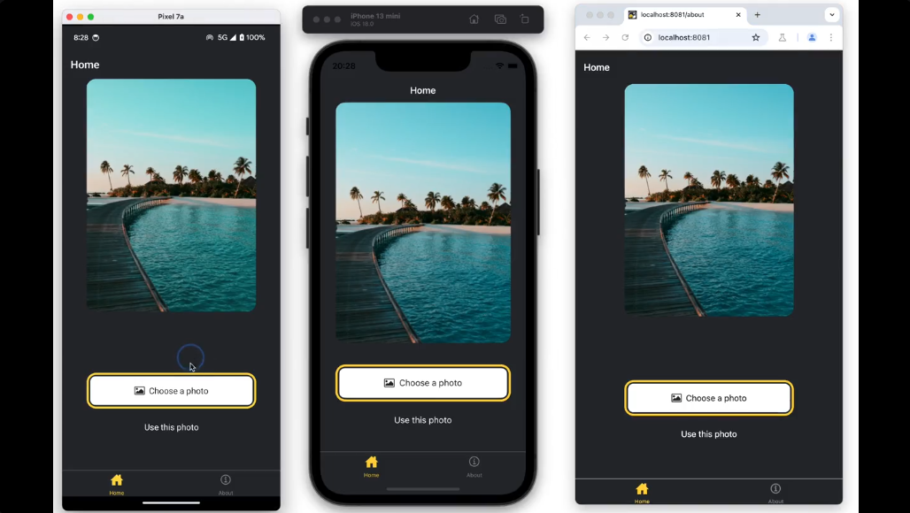

## 3.9. Use an image picker

Now, we will build a feature to select an image from the device's media gallery. This isn't possible with the core components and we'll need a library.

We'll use `expo-image-picker`, a library from Expo SDK that provides access to the system's UI to select images and videos from the phone's library.

### 3.9.1. Install expo-image-picker

Stop the development server, then run:

```bash
npx expo install expo-image-picker
```

> [!TIP]
> Any time we install a new library, stop the development server. After the installation completes, start the development server again.

### 3.9.2. Pick an image from the device's media library

`expo-image-picker` provides `launchImageLibraryAsync()` method to display the system UI by choosing an image or a video from the device's media library. We'll use the primary themed button created in the previous chapter to select an image from the device's media library and create a function to launch the device's image library to implement this functionality.

In `src/app/(tabs)/index.tsx`, import `expo-image-picker` library and create a `pickImageAsync()` function inside the `Index` component:

```tsx
// ...rest of the import statements remain unchanged
import * as ImagePicker from "expo-image-picker"

export default function Index() {
  const pickImageAsync = async () => {
    let result = await ImagePicker.launchImageLibraryAsync({
      mediaTypes: ["images"],
      allowsEditing: true,
      quality: 1,
    })

    if (!result.canceled) {
      console.log(result)
    } else {
      alert("You did not select any image.")
    }
  }

  // ...rest of the code remains same
}
```

When `allowsEditing` is set to `true`, the user can crop the image during the selection process on Android and iOS.

### 3.9.3. Update the button component

On pressing the primary button, we'll call the `pickImageAsync()` function on the `Button` component. Update the `onPress` prop of the `Button` component in `src/components/button.tsx`:

```tsx
// existing imports...

type Props = {
  // existing props...
  onPress?: () => void;
};

export default function Button({ label, theme, onPress }: Props) {
  if (theme === 'primary') {
    return (
      // ...
        <Pressable style={[styles.button, { backgroundColor: '#fff' }]} onPress={onPress}>
    // existing code...
```

In `src/app/(tabs)/index.tsx`, add the `pickImageAsync()` function to the `onPress` prop on the first `<Button>`:

```tsx
<Button theme="primary" label="Choose a photo" onPress={pickImageAsync} />
```

The `pickImageAsync()` function invokes `ImagePicker.launchImageLibraryAsync()` and then handles the `result` object containing information about the selected image.

Here is an example of the result object for Android (see the terminal output after selecting an image):

```json
{
  "assets": [
    {
      "assetId": null,
      "base64": null,
      "duration": null,
      "exif": null,
      "fileName": "ea574eaa-f332-44a7-85b7-99704c22b402.jpeg",
      "fileSize": 4513577,
      "height": 4570,
      "mimeType": "image/jpeg",
      "rotation": null,
      "type": "image",
      "uri": "file:///data/user/0/host.exp.exponent/cache/ExperienceData/%2540anonymous%252FStickerSmash-13f21121-fc9d-4ec6-bf89-bf7d6165eb69/ImagePicker/ea574eaa-f332-44a7-85b7-99704c22b402.jpeg",
      "width": 2854
    }
  ],
  "canceled": false
}
```

### 3.9.4. Use the selected image

The result object provides the `assets` array, which contains the `uri` of the selected image. Let's take this value and use it to show the selected image in the app.

Modify the `src/app/(tabs)/index.tsx` file:

1. Declare a state variable called `selectedImage`. We'll use it to hold the URI of the selected image.
2. Update the `pickImageAsync()` function to save the image URI in the `selectedImage` state variable.
3. Pass the `selectedImage` as a prop to the `ImageViewer` component.

```tsx
// existing imports...
import { useState } from "react"

const PlaceholderImage = require("@/assets/images/background-image.png")

export default function Index() {
  const [selectedImage, setSelectedImage] = useState<string | undefined>(
    undefined,
  )

  const pickImageAsync = async () => {
    // existing code...

    if (!result.canceled) {
      setSelectedImage(result.assets[0].uri)
    } else {
      alert("You did not select any image.")
    }
  }

  return (
    <View style={styles.container}>
      <View style={styles.imageContainer}>
        <ImageViewer
          imgSource={PlaceholderImage}
          selectedImage={selectedImage}
        />
      </View>
      {/* ...existing code... */}
    </View>
  )
}

// existing code...
```

Pass the `selectedImage` prop to the `ImageViewer` component to display the selected image instead of a placeholder image.

1. Modify the `src/components/image-viewer.tsx` file to accept the `selectedImage` prop.
2. The `source` of the image is getting long, so let's also move it to a separate variable called `imageSource`.
3. Pass `imageSource` as the value of the `source` prop on the `Image` component.

```tsx
// existing imports...

type Props = {
  imgSource: ImageSourcePropType
  selectedImage?: string
}

export default function ImageViewer({ imgSource, selectedImage }: Props) {
  const imageSource = selectedImage ? { uri: selectedImage } : imgSource

  return <Image source={imageSource} style={styles.image} />
}

// existing code...
```

The picked image is a `uri` string, not a local asset like the placeholder image.

Let's take a look at our app now. We can select an image from the device's media gallery and see it in the app.

## 3.10. Create a modal

A modal component displays an overlay to draw a user's attention toward critical information or guide them to take action.

React Native provides a `<Modal>` component that presents content above the rest of the app.

In this section, we'll create a modal that shows an emoji picker list.

### 3.10.1. Declare a state variable to show buttons

Before implementing the modal, we are going to add three new buttons. These buttons are visible after the user picks an image. One of these buttons will trigger the emoji picker modal.

In `src/app/(tabs)/index.tsx`:

1. Declare a boolean state variable, `showAppOptions`, to show or hide the buttons that open the modal, alongside a few other options. We'll set it to false by default. When the user picks an image or uses the placeholder image, we'll set it to true.
2. Update the `pickImageAsync()` function to set the value of `showAppOptions` to `true` after the user picks an image.
3. Update the button with no theme by adding an `onPress` prop.

```tsx
// existing codes...

export default function Index() {
  const [selectedImage, setSelectedImage] = useState<string | undefined>(
    undefined,
  )
  const [showAppOptions, setShowAppOptions] = useState<boolean>(false)

  const pickImageAsync = async () => {
    let result = await ImagePicker.launchImageLibraryAsync({
      mediaTypes: ["images"],
      allowsEditing: true,
      quality: 1,
    })

    if (!result.canceled) {
      setSelectedImage(result.assets[0].uri)
      setShowAppOptions(true)
    } else {
      alert("You did not select any image.")
    }
  }

  return (
    <View style={styles.container}>
      <View style={styles.imageContainer}>
        <ImageViewer
          imgSource={PlaceholderImage}
          selectedImage={selectedImage}
        />
      </View>
      {showAppOptions ? (
        // show an empty view
        <View />
      ) : (
        <View style={styles.footerContainer}>
          <Button
            theme="primary"
            label="Choose a photo"
            onPress={pickImageAsync}
          />
          <Button
            label="Use this photo"
            onPress={() => setShowAppOptions(true)}
          />
        </View>
      )}
    </View>
  )
}

// existing styles...
```

In the above snippet, when the value of `showAppOptions` is true, we render an empty `<View>` component. We'll address this state in the next step.

Now, we can remove the alert on the `Button` component and update the `onPress` prop when rendering the second button in the `src/components/button.tsx`:

```tsx
<Pressable style={styles.button}  onPress={onPress}>
```

### 3.10.2. Add buttons

Let's break down the layout of the option buttons we'll implement:

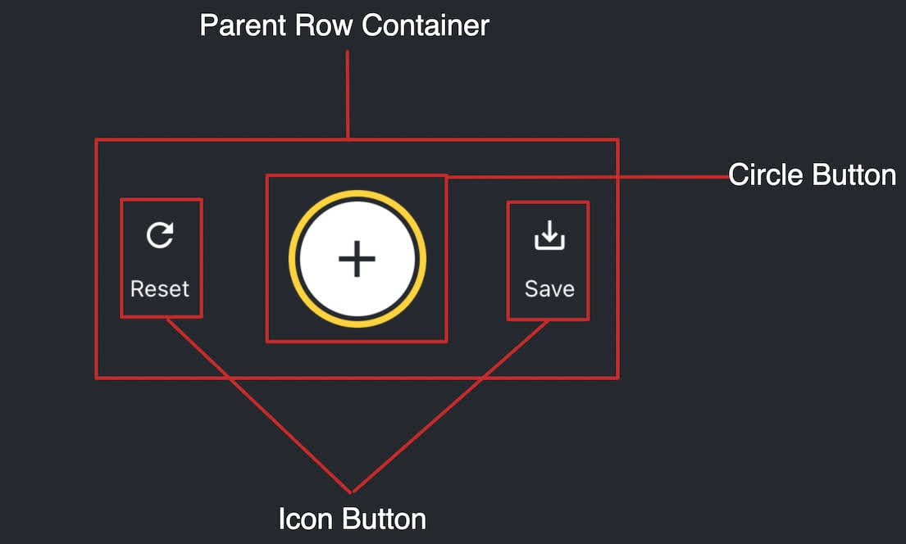

It contains a parent `<View>` with three buttons aligned in a row. The button in the middle with the plus icon (+) will open the modal and is styled differently.

We'll use MaterialIcons. So, first install the library:

```bash
npx expo install @react-native-vector-icons/material-icons
```

Inside the `src/components` directory, create a new `circle-button.tsx` file with the following code:

```tsx
import { MaterialIcons } from "@react-native-vector-icons/material-icons"
import { Pressable, StyleSheet, View } from "react-native"

type Props = {
  onPress: () => void
}

export default function CircleButton({ onPress }: Props) {
  return (
    <View style={styles.circleButtonContainer}>
      <Pressable style={styles.circleButton} onPress={onPress}>
        <MaterialIcons name="add" size={38} color="#25292e" />
      </Pressable>
    </View>
  )
}

const styles = StyleSheet.create({
  circleButtonContainer: {
    width: 84,
    height: 84,
    marginHorizontal: 60,
    borderWidth: 4,
    borderColor: "#ffd33d",
    borderRadius: 42,
    padding: 3,
  },
  circleButton: {
    flex: 1,
    justifyContent: "center",
    alignItems: "center",
    borderRadius: 42,
    backgroundColor: "#fff",
  },
})
```

To render the plus icon, this button uses the `<MaterialIcons>` icon set.

The other two buttons also use `<MaterialIcons>` to display vertically aligned text labels and icons. Create a file named `icon-button.tsx` inside the `src/components` directory. This component accepts three props:

1. `icon`: the name corresponding to the `MaterialIcons` library icon.
2. `label`: the text label displayed on the button.
3. `onPress`: this function invokes when the user presses the button.

`src/components/icon-button.tsx`

```tsx
import {
  MaterialIcons,
  MaterialIconsIconName,
} from "@react-native-vector-icons/material-icons"
import { Pressable, StyleSheet, Text } from "react-native"

type Props = {
  icon: MaterialIconsIconName
  label: string
  onPress: () => void
}

export default function IconButton({ icon, label, onPress }: Props) {
  return (
    <Pressable onPress={onPress} style={styles.iconButton}>
      <MaterialIcons name={icon} size={24} color={"#fff"} />
      <Text style={styles.iconButtonLabel}>{label}</Text>
    </Pressable>
  )
}

const styles = StyleSheet.create({
  iconButton: {
    justifyContent: "center",
    alignItems: "center",
  },
  iconButtonLabel: {
    color: "#fff",
    marginTop: 12,
  },
})
```

Inside `src/app/(tabs)/index.tsx`:

1. Import the `CircleButton` and `IconButton` components.
2. Add three placeholder functions for these buttons. The `onReset()` function invokes when the user presses the reset button, causing the image picker button to appear again. We'll add the functionality for the other two functions later.

```tsx
// Other imports...

import CircleButton from "@/components/circle-button"
import IconButton from "@/components/icon-button"

const PlaceholderImage = require("@/assets/images/background-image.png")

export default function Index() {
  // existing codes...

  const onReset = () => {
    setShowAppOptions(false)
  }

  const onAddSticker = () => {
    // we will implement this later
  }

  const onSaveImageAsync = () => {
    // we will implement this later
  }

  return (
    <View style={styles.container}>
      <View style={styles.imageContainer}>
        <ImageViewer
          imgSource={PlaceholderImage}
          selectedImage={selectedImage}
        />
      </View>

      {showAppOptions ? (
        <View style={styles.optionsContainer}>
          <View style={styles.optionsRow}>
            <IconButton icon="refresh" label="Reset" onPress={onReset} />
            <CircleButton onPress={onAddSticker} />
            <IconButton
              icon="save-alt"
              label="Save"
              onPress={onSaveImageAsync}
            />
          </View>
        </View>
      ) : (
        <View style={styles.footerContainer}>
          {/* existing buttons...
           */}
        </View>
      )}
    </View>
  )
}

const styles = StyleSheet.create({
  // Other existing styles...

  optionsContainer: {
    position: "absolute",
    bottom: 80,
  },
  optionsRow: {
    flexDirection: "row",
    alignItems: "center",
  },
})
```

Let's take a look at our app on Android, iOS and the web:

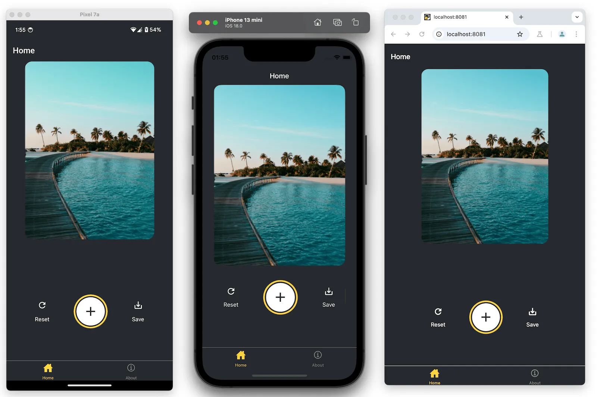

### 3.10.3. Create an emoji picker modal

The modal allows the user to choose an emoji from a list of available emoji. Create an `emoji-picker.tsx` file inside the `src/components` directory. This component accepts three props:

- `isVisible`: a boolean to determine the state of the modal's visibility.
- `onClose`: a function to close the modal.
- `children`: used later to display a list of emoji.

`src/components/emoji-picker.tsx`

```tsx
import { MaterialIcons } from "@react-native-vector-icons/material-icons"
import React from "react"
import { Modal, Pressable, StyleSheet, Text, View } from "react-native"

type Props = {
  isVisible: boolean
  onClose: () => void
  children?: React.ReactNode
}

export default function EmojiPicker({ isVisible, onClose, children }: Props) {
  return (
    <View>
      <Modal visible={isVisible} animationType="slide" transparent={true}>
        <View style={styles.modalContent}>
          <View style={styles.titleContainer}>
            <Text style={styles.title}>Choose a sticker</Text>
            <Pressable onPress={onClose}>
              <MaterialIcons name="close" color={"#fff"} size={22} />
            </Pressable>
          </View>
          {children}
        </View>
      </Modal>
    </View>
  )
}

const styles = StyleSheet.create({
  modalContent: {
    height: "25%",
    width: "100%",
    backgroundColor: "#25292e",
    borderTopRightRadius: 18,
    borderTopLeftRadius: 18,
    position: "absolute",
    bottom: 0,
  },
  titleContainer: {
    height: "16%",
    backgroundColor: "#464c55",
    borderTopRightRadius: 10,
    borderTopLeftRadius: 10,
    paddingHorizontal: 20,
    flexDirection: "row",
    justifyContent: "space-between",
    alignItems: "center",
  },
  title: {
    color: "#fff",
    fontSize: 16,
  },
})
```

What's going on here:

- The `<Modal>` creates an overlay and the `<View>` with `styles.modalContent` component displays a title and a close button.
- Its `visible` prop takes the value of `isVisible` and controls whether the modal is open or closed.
- The `<EmojiPicker>` invokes the `onClose` prop when the user presses the close `<Pressable>`.

Now, let's modify the `src/app/(tabs)/index.tsx`:

1. Import the `<EmojiPicker>` component.
2. Create an `isModalVisible` state variable. Its default value is false, which hides the modal until the user presses the button to open it.
3. Replace the comment in the `onAddSticker()` function to update the `isModalVisible` variable to `true` when the user presses the button.
4. Create the `onModalClose()` function to update the `isModalVisible` state variable.
5. Place the `<EmojiPicker>` component at the bottom.

`src/app/(tabs)/index.tsx`

```tsx
// Other existing imports...
import EmojiPicker from "@/components/emoji-picker"

const PlaceholderImage = require("@/assets/images/background-image.png")

export default function Index() {
  const [selectedImage, setSelectedImage] = useState<string | undefined>(
    undefined,
  )
  const [showAppOptions, setShowAppOptions] = useState<boolean>(false)
  const [isModalVisible, setIsModalVisible] = useState<boolean>(false)

  const pickImageAsync = async () => {
    // existing code...
  }

  const onReset = () => {
    setShowAppOptions(false)
  }

  const onAddSticker = () => {
    setIsModalVisible(true)
  }

  //new
  const onModalClose = () => {
    setIsModalVisible(false)
  }

  const onSaveImageAsync = async () => {
    // we will implement this later
  }

  return (
    <View style={styles.container}>
      <View style={styles.imageContainer}>
        {/* existing ImageViewer
         */}
      </View>

      {showAppOptions ? (
        <View style={styles.optionsContainer}>
          <View style={styles.optionsRow}>
            {/* existing Option Buttons
             */}
          </View>
        </View>
      ) : (
        <View style={styles.footerContainer}>
          {/* existing Image picker buttons
           */}
        </View>
      )}
      <EmojiPicker isVisible={isModalVisible} onClose={onModalClose}>
        {/* Emoji list component will go here */}
      </EmojiPicker>
    </View>
  )
}

// existing styles...
```

Here is the result after this step:

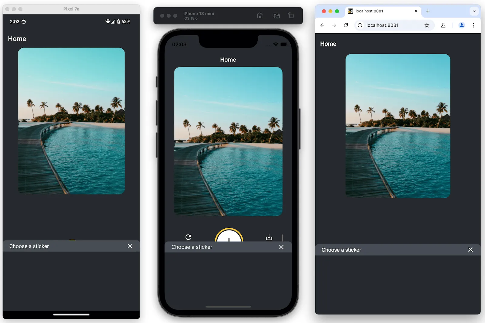

### 3.10.4. Display a list of emoji

Let's add a horizontal list of emoji in the modal's content. We'll use the `<FlatList>` component from React Native.

Create an `emoji-list.tsx` file inside the `src/components` directory:

```tsx
import { Image } from "expo-image"
import { useState } from "react"
import {
  FlatList,
  ImageSourcePropType,
  Platform,
  Pressable,
  StyleSheet,
} from "react-native"

type Props = {
  onSelect: (image: ImageSourcePropType) => void
  onCloseModal: () => void
}

export default function EmojiList({ onSelect, onCloseModal }: Props) {
  const [emoji] = useState<ImageSourcePropType[]>([
    require("@/assets/images/emoji1.png"),
    require("@/assets/images/emoji2.png"),
    require("@/assets/images/emoji3.png"),
    require("@/assets/images/emoji4.png"),
    require("@/assets/images/emoji5.png"),
    require("@/assets/images/emoji6.png"),
  ])

  return (
    <FlatList
      horizontal
      showsHorizontalScrollIndicator={Platform.OS === "web"}
      data={emoji}
      contentContainerStyle={styles.listContainer}
      renderItem={({ item, index }) => (
        <Pressable
          onPress={() => {
            onSelect(item)
            onCloseModal()
          }}
        >
          <Image source={item} key={index} style={styles.image} />
        </Pressable>
      )}
    />
  )
}

const styles = StyleSheet.create({
  listContainer: {
    borderTopRightRadius: 10,
    borderTopLeftRadius: 10,
    paddingHorizontal: 20,
    flexDirection: "row",
    alignItems: "center",
    justifyContent: "space-between",
  },
  image: {
    // width and height/aspect ratio required
    width: 100,
    height: 100,
    marginRight: 20,
  },
})
```

Let's see what the above code does:

- The `<FlatList>` component renders all the emoji images using the `Image` component, wrapped by a `<Pressable>`.
- It takes an array of items provided by the `emoji` array variable as the value of the `data` prop. The `renderItem` prop takes the `item` from the `data`. Finally, we added `Image` component to display this item.
- The `horizontal` prop renders the list horizontally. The `showsHorizontalScrollIndicator` uses React Native's `Platform` module to display the horizontal scroll bar on web.

Now, update the `src/app/(tabs)/index.tsx` to import the `<EmojiList>` component and replace the comments inside the `<EmojiPicker>` component with the following code snippet:

```tsx
// Other existing imports...
import { ImageSourcePropType, View, StyleSheet } from "react-native"
import EmojiList from "@/components/emoji-list"

const PlaceholderImage = require("@/assets/images/background-image.png")

export default function Index() {
  const [selectedImage, setSelectedImage] = useState<string | undefined>(
    undefined,
  )
  const [showAppOptions, setShowAppOptions] = useState<boolean>(false)
  const [isModalVisible, setIsModalVisible] = useState<boolean>(false)
  const [pickedEmoji, setPickedEmoji] = useState<
    ImageSourcePropType | undefined
  >(undefined)

  // existing functions...

  return (
    <View style={styles.container}>
      {/* existing Views...
       */}
      <EmojiPicker isVisible={isModalVisible} onClose={onModalClose}>
        <EmojiList onSelect={setPickedEmoji} onCloseModal={onModalClose} />
      </EmojiPicker>
    </View>
  )
}

// existing styles...
```

In the `EmojiList` component, the `onSelect` prop selects the emoji and after selecting it, the `onCloseModal` closes the modal.

Let's take a look at our app on Android, iOS and the web:

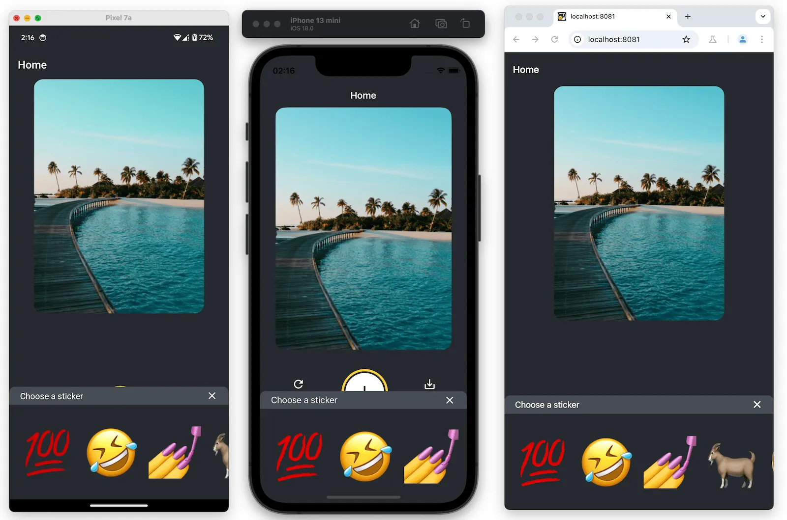

### 3.10.5. Display the selected emoji

Now, we'll put the emoji sticker on the image. Create a new file named `emoji-sticker.tsx` in the `src/components`:

```tsx
import { ImageSourcePropType, View } from "react-native"
import { Image } from "expo-image"

type Props = {
  imageSize: number
  stickerSource: ImageSourcePropType
}

export default function EmojiSticker({ imageSize, stickerSource }: Props) {
  return (
    <View style={{ top: -350 }}>
      <Image
        source={stickerSource}
        style={{ width: imageSize, height: imageSize }}
      />
    </View>
  )
}
```

This component receives two props:

- `imageSize`: a value defined inside the `Index` component. We will also use this value later to scale the image's size when tapped.
- `stickerSource`: the `source` of the selected emoji image.

Import this component in the `src/app/(tabs)/index.tsx` file and update the Index component to display the emoji sticker on the image. We will check if the `pickedEmoji` state is not `undefined`:

`src/app/(tabs)/index.tsx`

```tsx
// Other existing imports...
import EmojiSticker from "@/components/emoji-sticker"

const PlaceholderImage = require("@/assets/images/background-image.png")

export default function Index() {
  // existing codes...

  return (
    <View style={styles.container}>
      <View style={styles.imageContainer}>
        <ImageViewer
          imgSource={PlaceholderImage}
          selectedImage={selectedImage}
        />
        {pickedEmoji && (
          <EmojiSticker imageSize={40} stickerSource={pickedEmoji} />
        )}
      </View>
      {/* existing codes...
       */}
    </View>
  )
}

// existing styles...
```

Let's take a look at our app on Android, iOS and the web. You should see the emoji sticker on the image now.
